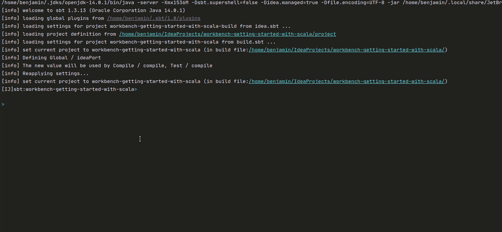

# :alembic: Getting started with scala


[](https://codeclimate.com/github/benjaminBoboul/workbench-getting-started-with-scala/maintainability)
[](https://github.com/benjaminBoboul/workbench-getting-started-with-scala/wiki)  


This repository contains multiples tests with a documentation to understand some scala and algorithm principles



## :bookmark: Summary

In `src/test/scala` :

- `TestScala` contains multiples tests to demonstrate the syntax,
- `calculus/TestComplex` test complex object to show off function
- `generator/TestStringCombination` test to show off all possibles string permutation from a size span and a char Seq.

## :test_tube: How to run tests

__If you use Intellij Idea editor__:
1. Get the contextual menu of folder `src/test/scala` and select `Run ScalaTests in scala`

__If you use sbt__:
1. simply type `sbt test` or `sbt` then `test`:
    ```sbtshell
    [IJ]sbt:workbench-getting-started-with-scala> test
    [info] Compiling 1 Scala source to /home/benjamin/IdeaProjects/workbench-getting-started-with-scala/target/scala-2.13/test-classes ...
    [info] Done compiling.
    [info] TestStringCombination:
    [info] String combination
    [info] - should return all possible combination possible
    [info] TestComplex:
    [info] Complex
    [info] - should return Exponential form
    [info] - should compute modulus correctly
    [info] - should compute argument correctly
    [info] TestScala:
    [info] ...
    [info] - should be easy to manage
    [info] Run completed in 182 milliseconds.
    [info] Total number of tests run: 15
    [info] Suites: completed 3, aborted 0
    [info] Tests: succeeded 15, failed 0, canceled 0, ignored 0, pending 0
    [info] All tests passed.
    [success] Total time: 1 s, completed 30 juin 2020 à 11:54:13
    ```

## :book: Documentation

You'll find some notes and documentation directly into the [wiki](https://github.com/benjaminBoboul/workbench-getting-started-with-scala/wiki) section of this repository

